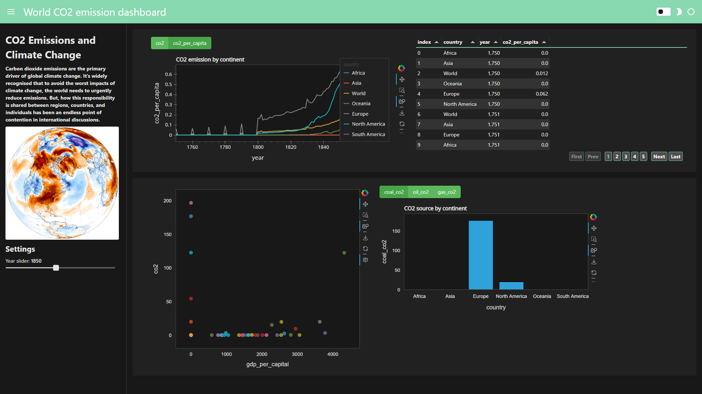

# Python Dashboard Panel
### Interactive visualization dashboard in Python with Panel

This repo contains code for the portfolio project

If you want to see all the dependencies for this project, please see requirements.txt file.

To serve the dashboard locally, use the command:
```
panel serve Interactive_dashboard.ipynb
```

